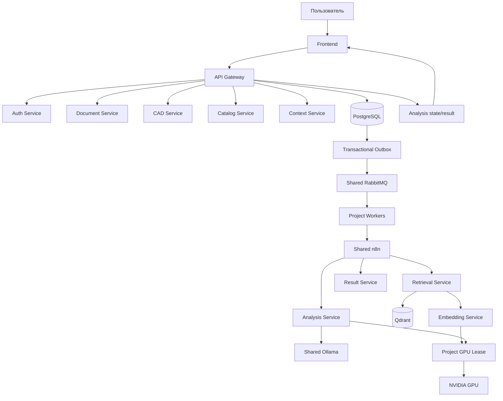

<!-- README.md -->

# Plan Validator — Drawing Validation AI

> **Статус документа:** этот README описывает целевой контракт и конечный вид
> Plan Validator после завершения roadmap. До окончания всех этапов отдельные
> возможности из этого документа могут ещё не быть реализованы. Фактическая
> готовность определяется `docs/ROADMAP.md`, текущими tests и состоянием
> runtime stack.

Plan Validator — локальная система проверки проектной и рабочей документации по нормативной базе, техническому заданию, пользовательским пакетам документов, контексту пояснительной записки и Базе Опыта.

Пользователь загружает основной проектный файл, при необходимости CAD-файл, Техническое задание и Пояснительную записку, выбирает нормативный раздел и пользовательские документы. Система извлекает текст и геометрию, индексирует временный контекст, выполняет typed retrieval по источникам `N/T/U/E`, запускает локальный VLM-анализ и возвращает структурированные замечания с визуальной привязкой к листам.

Проект построен как набор bounded-context микросервисов. Shared Ollama, RabbitMQ и n8n переиспользуются через отдельный repository `shared_infrasktructure`, а PostgreSQL, Qdrant, application workers, project volumes и business services принадлежат только Plan Validator.

---

# Возможности

- регистрация и аутентификация через opaque sessions;
- PDF-only анализ;
- multi-page PDF;
- DXF analysis;
- DWG -> DXF normalization;
- adapter boundary для КОМПАС-файлов;
- PDF + CAD как два представления одного проектного листа;
- выбор отдельных страниц основного проекта;
- Technical Assignment как отдельный временный project/customer source;
- multimodal indexing страниц ТЗ;
- временный Project Context из Пояснительной записки;
- T-guided нормативный retrieval;
- managed нормативные разделы и вложенные категории;
- пользовательские пакеты документов внутри выбранного раздела;
- PDF/DOC/DOCX upload;
- Word -> PDF preview через LibreOffice;
- transactional outbox для durable background operations;
- scoped normative RAG по immutable analysis snapshot;
- scoped retrieval выбранных пользовательских документов;
- отдельный system prompt нормативного раздела;
- transient working prompt;
- кликабельные N/T/U sources через API Gateway;
- База Опыта `E`;
- единая embedding identity для N/T/U/E/PZ;
- stable Qdrant aliases для persistent collections;
- model fingerprint и управляемая reindex migration;
- selective background queues только для тяжёлых операций;
- cross-process GPU lease;
- RAM/VRAM admission;
- bounded retries;
- idempotent cleanup временных файлов и Qdrant collections;
- ограниченная retention logs;
- временные ТЗ и ПЗ автоматически удаляются;
- bbox/callout result overlay;
- SVG-разметка замечаний поверх рендера листа;
- ordered textual findings;
- unit, integration, API, architecture, runtime, GPU, queue и E2E tests.

---

# Семантика источников N / T / U / E

Источники не объединяются в одну семантическую роль.

| Префикс | Тип | Роль |
|---|---|---|
| `N1`, `N2`, ... | Normative | нормативная база: ГОСТ, СП, ПУЭ и другие нормативные требования |
| `T1`, `T2`, ... | Technical Assignment | требования ТЗ, заказчика и проекта |
| `U1`, `U2`, ... | User Package | пользовательские документы проекта/заказчика |
| `E1`, `E2`, ... | Experience | База Опыта для finalization/recommendation |

Отдельно используется:

```text
PZ = временный Project Context
```

ПЗ помогает интерпретировать проект, но не становится нормативным доказательством.

Главные правила:

- только `N` подтверждает утверждение о нарушении нормативного документа;
- `T` может подтверждать `customer_requirements`;
- `T` может направлять targeted N retrieval, но не превращается в `N`;
- `U` остаётся пользовательским/project source;
- `E` используется для опыта, finalization и рекомендаций;
- finding без N/T/U может сохраняться как инженерное/визуальное замечание со статусом `needs_review`;
- `normative_control` без валидного `N` не подтверждается только на основании `T` или `U`.

Typed source arrays:

```text
basis_sources                       = N
technical_assignment_basis_sources  = T
user_package_basis_sources          = U
experience_sources                  = E
```

---

# Технологии

| Слой | Технологии |
|---|---|
| Backend | Python 3.12, FastAPI, Pydantic |
| Persistence | PostgreSQL 16, SQLAlchemy AsyncIO, Alembic |
| Queue | RabbitMQ, Celery |
| Orchestration | n8n |
| Vector DB | Qdrant |
| Analysis VLM | shared Ollama + `qwen3-vl:8b-instruct` |
| Embeddings | dedicated embedding service |
| PDF | PyMuPDF |
| Word | LibreOffice headless |
| CAD | ezdxf, LibreDWG / adapters |
| Frontend | HTML, CSS, JavaScript, nginx |
| Containers | Docker, Docker Compose |
| Tests / style | pytest, Ruff |

---

# Shared infrastructure

Shared services запускаются отдельно в repository:

```text
shared_infrasktructure
```

Plan Validator переиспользует:

```text
Ollama    http://ollama:11434
RabbitMQ  rabbitmq:5672
n8n       http://n8n:5678
```

через external Docker network:

```text
ai-shared
```

Plan Validator не создаёт собственные копии Ollama, RabbitMQ или n8n.

Project-specific infrastructure:

```text
PostgreSQL
Qdrant
Celery/application workers
application services
project volumes
GPU coordination volume
```

---

# Архитектура

## Bounded contexts

```text
frontend
api-gateway
auth-service
document-service
cad-service
catalog-service
context-service
embedding-service
retrieval-service
experience-service
analysis-service
result-service
```

## Направление зависимостей backend

```text
Transport / Delivery
        ↓
Application
        ↓
Domain

Infrastructure ──implements──> Application ports
```

Правила:

- thin HTTP routers;
- SQLAlchemy только в infrastructure/database/repositories;
- одна предметная repository abstraction на одну cohesive область;
- application/domain не зависят от FastAPI, SQLAlchemy, Celery, Qdrant, Ollama adapters;
- concrete dependencies собираются в composition root;
- transaction boundary соответствует use-case;
- значимые service/use-case operations измеряются единым timing decorator;
- каждый файл, класс и функция имеют содержательную русскую документацию.

---

# Общая схема анализа



---

# Очереди

Обычный пользовательский HTTP flow не отправляется в RabbitMQ автоматически.

Inline по умолчанию:

```text
login
logout
navigation
обычный GET
CRUD metadata
простая validation
лёгкие operations
```

В background queue выносятся операции, которые действительно являются тяжёлыми или конкурентными:

```text
GPU embedding inference
GPU VLM analysis
массовая indexing operation
тяжёлая CPU conversion/render operation — только если benchmark это подтверждает
```

Основные queue namespaces:

```text
plan-validator.gpu.embedding
plan-validator.gpu.analysis
```

CPU-heavy queue добавляется только при доказанной необходимости.

GPU-heavy worker baseline:

```text
concurrency = 1
prefetch = 1
```

---

# GPU coordination

Все GPU-heavy Plan Validator operations используют project-wide cross-process lease:

```text
/var/lock/plan-validator-gpu/gpu.lock
```

Порядок:

```text
acquire lease
  -> check free RAM / VRAM
  -> load/use model
  -> inference
  -> unload/release runtime resources
  -> release lease
```

Обычный `nvidia-smi` preflight без lease не является механизмом координации.

Development baseline:

```text
GPU: NVIDIA GeForce RTX 3090
VRAM: 24 GiB
RAM: 32 GiB
```

Analysis model:

```text
qwen3-vl:8b-instruct
```

Embedding model, dtype, batch size и admission thresholds определяются через project configuration и подтверждаются runtime benchmark.

---

# PostgreSQL

Каждый bounded context владеет только своими таблицами/схемами.

Принципы:

- SQLAlchemy queries находятся только в repository layer;
- commit/rollback не расползается по routers;
- transactional outbox создаётся в той же транзакции, что и business state;
- миграции проверяются на startup отдельным migration job;
- Alembic current/head выводится в startup diagnostics.

Типовые entities:

```text
users
sessions
analysis_jobs
analysis_artifacts
outbox_messages

catalog.sections
catalog.categories
catalog.documents
catalog.outbox_messages

context.technical_assignments
context.project_contexts
context.cleanup_registry

experience.cases
```

Точная физическая схема определяется migrations соответствующих сервисов.

---

# Qdrant

Persistent managed vector spaces используют stable aliases.

Примеры:

```text
plan_validator_catalog_active
plan_validator_experience_active
```

Physical collection определяется fingerprint:

```text
fingerprint = sha256(model | dimension | schema_version)[:16]
```

Temporary collections не используют persistent alias:

```text
plan_validator_t_<context_id>
plan_validator_pz_<context_id>
```

T/PZ collections удаляются по lifecycle/TTL.

---

# Technical Assignment

ТЗ является временным analysis context.

Lifecycle:

```text
upload
  -> queued
  -> indexing
  -> ready
  -> used by analysis
  -> expired
  -> cleanup_pending
  -> cleaning
  -> cleaned
```

После terminal analysis state действует configurable grace period.

Default:

```text
24 hours
```

Удаляются:

- original T file;
- PDF preview;
- extracted text;
- page renders;
- temporary chunks;
- T vector collection;
- intermediate indexing files.

Если cleanup dependency временно недоступна, state становится retryable `cleanup_failed`.

---

# Пояснительная записка

ПЗ является временным Project Context.

Временно хранятся:

- выбранный page range;
- extracted text fragments;
- rendered pages, если они нужны pipeline;
- temporary chunks;
- temporary PZ collection;
- processing workspace.

Collection:

```text
plan_validator_pz_<context_id>
```

Default cleanup:

```text
analysis terminal state + 24 hours
```

Если scratch resource больше не нужен, он удаляется сразу; TTL является safety net для crash/restart scenarios.

---

# Retention и cleanup

Временные данные не хранятся бессрочно.

Default policy:

```text
Technical Assignment context      24 hours after terminal state
PZ Project Context                24 hours after terminal state
stale/abandoned uploads           24 hours
processing scratch                max 24 hours
main analysis source              30 days
final result artifacts            30 days
project log files                 14 days
```

Managed `N/U/E` данные являются persistent и удаляются только по явному business action или отдельной утверждённой policy.

Cleanup:

- idempotent;
- retryable;
- service-owned;
- batch-limited;
- observable;
- не выполняется через «rm по маске»;
- SQL state не объявляет объект полностью удалённым до подтверждённой очистки owned file/vector resources.

---

# Логирование

Каждый backend service пишет structured logs в stdout/stderr.

Дополнительно проект использует bounded service log directories:

```text
var/log/
├── api-gateway/
├── auth-service/
├── document-service/
├── cad-service/
├── catalog-service/
├── context-service/
├── embedding-service/
├── retrieval-service/
├── experience-service/
├── analysis-service/
└── result-service/
```

Docker logging baseline:

```text
max-size = 10 MiB
max-file = 5
```

Project file logging baseline:

```text
active file soft limit = 20 MiB
rotated archives       = 7
absolute max age       = 14 days
```

Logs не содержат:

```text
password
session token
Authorization header
RabbitMQ password
PostgreSQL password
API key
полный пользовательский документ
```

Значимые операции используют timing decorator:

```text
event=operation_timing
operation=<stable name>
duration_ms=<number>
status=success|error
```

---

# Frontend

Layout:

```text
header
├── logo
└── registration / authentication controls

body
├── sidebar
│   ├── section create/edit/delete
│   ├── Technical Assignment upload/clear
│   ├── normative documents
│   ├── user documents
│   └── system prompt
│
└── main-container
    ├── main project upload
    ├── CAD upload
    ├── explanatory-note context
    ├── analysis status
    ├── rendered selected sheets
    ├── SVG bbox/callout overlay
    └── ordered textual findings

footer
```

Frontend rules:

- semantic HTML;
- BEM;
- один `style.css` entrypoint;
- CSS по blocks/features;
- common JS отдельно от feature JS;
- `data-*` hooks;
- нет inline `onclick`;
- нет unsafe `innerHTML` для недоверенных данных;
- accessibility обязательна;
- critical UI flows покрыты tests/E2E.

Пример BEM:

```text
.sheet-preview
.sheet-preview__image
.sheet-preview__overlay
.sheet-preview__bbox
.sheet-preview__callout
.sheet-preview__callout-line
.sheet-preview__callout-text
```

---

# Result model

Frontend не использует «прожжённый» PNG как единственный source of truth.

Result Service возвращает:

```text
page render
normalized bbox
leader/callout coordinates
finding text
typed source links
finding status/severity/confidence
```

Frontend строит масштабируемый SVG overlay поверх render.

При клике на finding:

- соответствующий bbox подсвечивается;
- viewport может перейти к нужному листу;
- typed source может быть открыт через API Gateway.

---

# Public API

## Auth

```text
POST /api/v1/auth/register
POST /api/v1/auth/login
POST /api/v1/auth/logout
GET  /api/v1/auth/me
```

## Analyses

```text
POST   /api/v1/analyses
GET    /api/v1/analyses/{analysis_id}
GET    /api/v1/analyses/{analysis_id}/result
DELETE /api/v1/analyses/{analysis_id}
```

## Catalog sections

```text
GET    /api/v1/catalog/sections
POST   /api/v1/catalog/sections
GET    /api/v1/catalog/sections/{section_id}
PATCH  /api/v1/catalog/sections/{section_id}
DELETE /api/v1/catalog/sections/{section_id}
```

## Categories

```text
GET    /api/v1/catalog/sections/{section_id}/categories
POST   /api/v1/catalog/sections/{section_id}/categories
GET    /api/v1/catalog/categories/{category_id}
PATCH  /api/v1/catalog/categories/{category_id}
DELETE /api/v1/catalog/categories/{category_id}
```

## Normative documents

```text
GET    /api/v1/catalog/sections/{section_id}/normative-documents
POST   /api/v1/catalog/sections/{section_id}/normative-documents
GET    /api/v1/catalog/normative-documents/{document_id}
PATCH  /api/v1/catalog/normative-documents/{document_id}
DELETE /api/v1/catalog/normative-documents/{document_id}
POST   /api/v1/catalog/normative-documents/{document_id}/index
GET    /api/v1/catalog/normative-documents/{document_id}/content
```

## User documents

```text
GET    /api/v1/catalog/sections/{section_id}/user-documents
POST   /api/v1/catalog/sections/{section_id}/user-documents
GET    /api/v1/catalog/user-documents/{document_id}
PATCH  /api/v1/catalog/user-documents/{document_id}
DELETE /api/v1/catalog/user-documents/{document_id}
POST   /api/v1/catalog/user-documents/{document_id}/index
GET    /api/v1/catalog/user-documents/{document_id}/content
```

## Technical Assignment

```text
POST   /api/v1/context/technical-assignments
GET    /api/v1/context/technical-assignments/{technical_assignment_id}
DELETE /api/v1/context/technical-assignments/{technical_assignment_id}
GET    /api/v1/context/technical-assignments/{technical_assignment_id}/content
```

Browser не обращается напрямую к internal services.

---

# n8n workflows

Repository:

```text
n8n/workflows/
```

Workflow names используют namespace:

```text
[PLAN-VALIDATOR] ...
```

n8n отвечает за orchestration между сервисами, но не хранит business truth и не изменяет typed source semantics.

---

# Структура проекта

```text
plan-validator/
├── docs/
│   ├── ARCHITECTURE.md
│   ├── DEVELOPMENT_PROCESS.md
│   ├── RETENTION_POLICY.md
│   ├── ROADMAP.md
│   └── SHARED_ENGINEERING_STANDARD.md
│
├── frontend/
│   ├── Dockerfile
│   ├── nginx.conf
│   └── src/
│       ├── index.html
│       ├── partials/
│       ├── css/
│       │   ├── style.css
│       │   ├── variables.css
│       │   ├── global.css
│       │   ├── responsive.css
│       │   └── blocks/
│       └── js/
│           ├── api.js
│           ├── app.js
│           ├── state.js
│           ├── components/
│           └── features/
│
├── packages/
│   └── common/
│       └── src/plan_validator_common/
│           ├── configuration/
│           ├── observability/
│           └── errors/
│
├── services/
│   ├── api-gateway/
│   ├── auth-service/
│   ├── document-service/
│   ├── cad-service/
│   ├── catalog-service/
│   ├── context-service/
│   ├── embedding-service/
│   ├── retrieval-service/
│   ├── experience-service/
│   ├── analysis-service/
│   └── result-service/
│
├── n8n/
│   └── workflows/
│
├── scripts/
├── ops/
├── tests/
│   ├── architecture/
│   ├── runtime/
│   └── e2e/
│
├── var/
│   └── log/
│
├── .dockerignore
├── .env.example
├── .gitattributes
├── .gitignore
├── compose.yaml
├── pyproject.toml
├── requirements-dev.txt
└── README.md
```

---

# Конфигурация

`.env.example` — committed baseline и полный каталог ordinary runtime settings.

`.env` — sparse private override.

Базово достаточно:

```dotenv
PLAN_VALIDATOR_POSTGRES_PASSWORD=replace-me
PLAN_VALIDATOR_RABBITMQ_PASSWORD=replace-me
```

Pydantic Settings pattern:

```python
SettingsConfigDict(
    env_file=(".env.example", ".env"),
    case_sensitive=False,
    env_nested_delimiter="__",
)
```

Compose использует безопасные defaults для non-secret settings и required expansion для обязательных secrets.

---

# Запуск

Prerequisites:

- Docker Engine;
- Docker Compose plugin;
- работающий `shared_infrasktructure`;
- существующая external network `ai-shared`;
- shared Ollama/RabbitMQ/n8n healthy.

Первый и рекомендуемый запуск:

```bash
./scripts/up.sh
```

Launcher выполняет:

```text
shared infrastructure preflight
sparse .env generation
project RabbitMQ provisioning
Ollama model presence check
Docker Compose validation
build
quality/tests startup gate
migrations
Alembic head verification
project services startup
health/readiness verification
```

После bootstrap штатный запуск:

```bash
docker compose up -d --build
```

Проверка:

```bash
./scripts/check-stack.sh
```

Остановка:

```bash
docker compose down
```

Не использовать при обычном deploy:

```bash
docker compose down -v
```

если требуется сохранить persistent PostgreSQL/Qdrant/application volumes.

---

# Health endpoints

Каждый long-running HTTP backend:

```text
GET /health/live
GET /health/ready
```

`live` — процесс работает.

`ready` — обязательные dependencies конкретного service готовы.

Readiness не запускает тяжёлый ML inference.

---

# Тестирование

Root quality:

```bash
ruff check .
ruff format --check .
pytest
git diff --check
```

Architecture tests:

```bash
pytest tests/architecture
```

Docker/integration:

```bash
docker compose --profile test build
docker compose --profile test run --rm quality-tests
docker compose --profile test run --rm integration-tests
```

GPU runtime:

```bash
docker compose --profile gpu-runtime-test run --rm gpu-runtime-tests
```

Queue tests:

```bash
docker compose --profile queue-test run --rm queue-tests
```

E2E:

```bash
docker compose --profile e2e-test run --rm e2e-tests
```

Load/runtime validation выполняется отдельным profile и не запускается на каждом обычном reboot.

---

# Runtime validation

Проверяются:

- GPU serialization;
- embedding/analysis contention;
- RAM peak;
- VRAM peak;
- queue backlog;
- queue retry/idempotency;
- failure recovery;
- temporary T/PZ cleanup;
- stale upload cleanup;
- orphan diagnostics;
- log rotation;
- file retention;
- Qdrant temporary collection cleanup;
- multi-user API concurrency;
- frontend critical flows.

---

# Backup

Persistent backup scope:

```text
PostgreSQL
Qdrant persistent collections
managed normative files
managed user documents
Experience data
retained analysis results according to policy
```

Temporary T/PZ/scratch data не считается обязательной backup data.

---

# Security

- `.env` не коммитится;
- passwords хэшируются;
- session token хранится в HttpOnly cookie;
- storage хранит только безопасное представление session token;
- browser работает только через API Gateway;
- internal DB/Qdrant ports не публикуются без необходимости;
- shared infrastructure используется через Docker DNS;
- secrets не пишутся в logs;
- загруженные пользовательские данные не отправляются во внешние cloud LLM по умолчанию;
- N/T/U/E source roles валидируются backend, а не доверяются LLM output.

---

# Code style

Source of truth:

```text
Amadu-A/shared_infrasktructure/docs
```

Обязательны:

```text
LLM_CONTEXT.md
ENGINEERING_GUIDELINES.md
FRONTEND_GUIDELINES.md
INFRASTRUCTURE_INSTRUCTIONS.md
services.yaml
```

Ключевые project rules:

- каждый router — отдельный cohesive файл;
- repositories разделены по предметной ответственности;
- нет god-files;
- нет SQL в transport/application;
- DI через ports/composition root;
- русская документация файлов/functions/classes;
- timing decorator для значимых операций;
- BEM + modular frontend;
- tests вместе с ключевой logic;
- temporary resource feature обязательно включает cleanup.

---

# Definition of Done

Проект считается готовым после выполнения всех acceptance conditions:

```text
[ ] docker compose config проходит
[ ] ./scripts/up.sh поднимает проект без ручной последовательности команд
[ ] health/readiness всех сервисов проходят
[ ] migrations на head
[ ] shared services не дублируются
[ ] ai-shared используется только нужными сервисами
[ ] PostgreSQL/Qdrant project data изолированы
[ ] registration/login/logout/me работают
[ ] N/U catalog работает
[ ] T temporary lifecycle работает
[ ] PZ temporary context работает
[ ] CAD pipeline работает
[ ] embedding runtime работает
[ ] N/T/U/E retrieval сохраняет typed semantics
[ ] Analysis VLM работает через shared Ollama
[ ] GPU contention сериализован
[ ] result bbox/callouts отображаются
[ ] clickable sources работают
[ ] temporary T/PZ files удаляются
[ ] temporary Qdrant collections удаляются
[ ] stale uploads очищаются
[ ] log rotation и retention работают
[ ] unit tests проходят
[ ] integration tests проходят
[ ] architecture tests проходят
[ ] GPU runtime tests проходят
[ ] queue tests проходят
[ ] E2E tests проходят
[ ] load/failure tests проходят
[ ] backup/restore documented and verified
[ ] README и architecture docs соответствуют фактической реализации
```